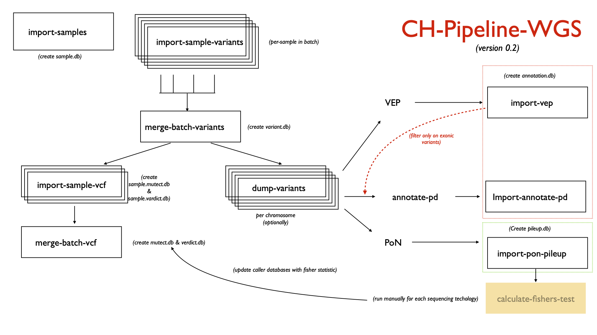

# CH Toolkit

A collection of utilities and tools used in the Clonal Hematopoiesis (CH) pipeline.  More details coming soon!

## Cloud Pipeline

_<Placeholder about WDL/Cloud pipeline for realignment, variant calling, and Panel-of-Normal pileup>_

## Annotation Database Management

### CLI

```
Usage: ch-toolkit [OPTIONS] COMMAND [ARGS]...

  A collection of db related tools for handling sample data.

Options:
  --version   Show the version and exit.
  -h, --help  Show this message and exit.

Commands:
  calculate-fishers-test  Updates the variants inside Mutect or Vardict tables
                          with p-value from Fisher's Exact Test
  dump-annotations        dumps all variant annotations inside duckdb into a
                          CSV file
  dump-ch                 Outputs CH Variants from Database
  dump-variants           dumps all variants inside duckdb into a VCF file
  import-annotate-pd      annotates variants with their pathogenicity
  import-pon-pileup       updates variants inside duckdb with PoN pileup
                          information
  import-sample-variants  Register the variants for a VCF file into a variant
                          database
  import-sample-vcf       import a vcf file into sample variant database
  import-samples          Loads a CSV containing samples into samples database
  import-vep              updates variants inside duckdb with VEP information
  merge-batch-variants    Combines all sample variant databases into a single
                          database
  merge-batch-vcf         Combines all sample vcfs databases into a single
                          database
```

### Workflow Diagram



